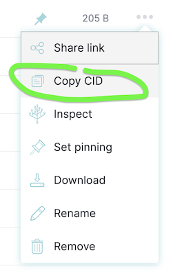

# PlantsAndPillars Smartcontract Lottery

1. Run your local blockchain with the lottery code
```
git clone https://github.com/PatrickAlphaC/hardhat-fund-me-fcc
cd hardhat-fund-me-fcc
yarn 
yarn hardhat node
```

2. Add hardhat network to your metamask/wallet

- Get the RPC_URL of your hh node (usually `http://127.0.0.1:8545/`)
- Go to your wallet and add a new network. [See instructions here.](https://metamask.zendesk.com/hc/en-us/articles/360043227612-How-to-add-a-custom-network-RPC)
  - Network Name: Hardhat-Localhost
  - New RPC URL: http://127.0.0.1:8545/
  - Chain ID: 31337
  - Currency Symbol: ETH (or GO)
  - Block Explorer URL: None

Ideally, you'd then [import one of the accounts](https://metamask.zendesk.com/hc/en-us/articles/360015489331-How-to-import-an-Account) from hardhat to your wallet/metamask. 

3. Run this code

Back in a different terminal with the code from this repo, run:

```
yarn dev
```

4. Go to UI and have fun!

Head over to your [localhost](http://localhost:3000) and play with the lottery!

# Deploying to IPFS

1. Build your static code.

```
yarn build
```

2. Export your site

```
yarn next export
```

> Note: Some features of NextJS & Moralis are not static, if you're deviating from this repo, you might run into errors. 

3. Deploy to IPFS

- [Download IPFS desktop](https://ipfs.io/#install)
- Open your [IPFS desktop app](https://ipfs.io/)
- Select `import` and choose the folder the above step just created (should be `out`)

4. Copy the CID of the folder you pinned



5. Get [IPFS companion](https://chrome.google.com/webstore/detail/ipfs-companion/nibjojkomfdiaoajekhjakgkdhaomnch?hl=en) for your browser (or use [Brave Browser](https://brave.com/))

5. Go to `ipfs://YOUR_CID_HERE` and see your ipfs deployed site!

# Linting

To check linting / code formatting:
```
yarn lint
```


# Thank you!

