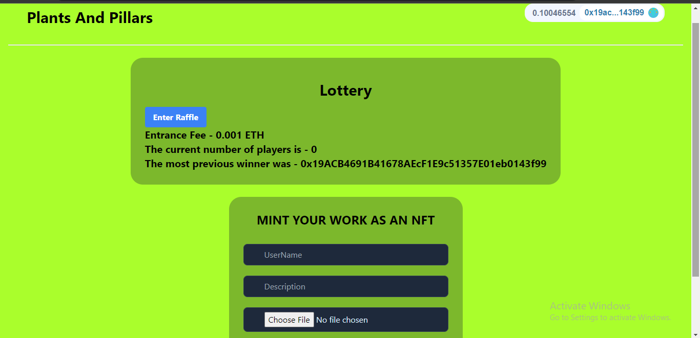

# Plants And Pillars

Project Description -
- Plants and Pillars is a decentralized organization that aims to encourage people to plant more trees and make Earth a better place to live in.
- We aim to build a community of enthusiasts who'll help us achieve our goal of planting 1 million trees through this project.

## Objectives

---

Core Objectives and Future Plans of Plants And Pillars-

- 🔗 **Connecting**: Our aim is to connect and make people aware of the importance of trees to human mankind.
- 💵 Award: We'll randomly award our supporters to add a P2E environment to this projection in order to keep the people engaged in this project which will eventually help mother Nature.
- 🔔 **Update**: With the help of EPNS help, users are notified whenever they get anything credited/ debited.
- 📈 **Streaming Money**: Send money over time with the integration with Superfluid.
- 📚 **Education:** Our Organization will also make people aware of the current situation on Earth and educate them regarding the global issues of **SAVE SOIL**, **GLOBAL WARMING**, etc.
- 🌍 **Plants and Pillars DAO**: This will help our community to take all the important decisions in a decentralized way and help in the smooth functioning of the project.
- 🎯 **GOAL**: Our Ultimate Goal is to reduce carbon emissions by planting more and more trees and educating people about our current environmental issues.


### Implementation and MVP for Gitcoin **Sustainable Blockchain Hackathon**

---

- I alone started this project in Gitcoin **Sustainable Blockchain Hackathon**.
- GitHub Repository - https://github.com/aviral10x/PlantsAndPillars

- A Lottery Game to keep our supporters engaged to keep planting trees and get an equal chance of winning every day.

- **Use of Chainlink -**
- Chainlink VRF (Verifiable Random Function) - [https://github.com/aviral10x/PlantsAndPillars/blob/main/backend/contracts/Raffle.sol](https://github.com/aviral10x/PlantsAndPillars/blob/main/backend/contracts/Raffle.sol)
- This is used to generate a random winner from the list of people who have planted trees on a particular day and have minted their NFTs.
- Chainlink Keepers Functions - [https://github.com/aviral10x/PlantsAndPillars/blob/main/backend/contracts/Raffle.sol](https://github.com/aviral10x/PlantsAndPillars/blob/main/backend/contracts/Raffle.sol)
- This is used to automate the smart contracts by running the Verifiable Random Function to help in selecting the winner every day.
- The checkUpkeep function will check if the lottery has ended or not.
- the performUpkeep function will automatically execute the functions in a set time period when the day has ended. This function also automatically sends the amount to the winner of that day.

- **Use of IPFS -**
- I have used NFT Port to mint the images clicked by the users as NFTs.
- The images get minted as an NFT and get stored on the IPFS.
- I have also used Fleek to host the website on IPFS - [https://dark-mud-0966.on.fleek.co/](https://dark-mud-0966.on.fleek.co/)
- Implementation of NFTPORT - [https://github.com/aviral10x/PlantsAndPillars/blob/main/components/MintNFT.js](https://github.com/aviral10x/PlantsAndPillars/blob/main/components/MintNFT.js)

### WORKING DEMO OF MVP - https://dark-mud-0966.on.fleek.co/


### VIDEO OF WORKING DEMO AND EXPLAINATION ABOUT THE PROJECT - https://youtu.be/1EienYGbMdIl

### TESTING GUIDE - 

1. Run your local blockchain with the lottery code
```
git clone https://github.com/PatrickAlphaC/hardhat-fund-me-fcc
cd hardhat-fund-me-fcc
yarn 
yarn hardhat node
```

2. Add hardhat network to your metamask/wallet

- Get the RPC_URL of your hh node (usually `http://127.0.0.1:8545/`)
- Go to your wallet and add a new network. [See instructions here.](https://metamask.zendesk.com/hc/en-us/articles/360043227612-How-to-add-a-custom-network-RPC)
  - Network Name: Hardhat-Localhost
  - New RPC URL: http://127.0.0.1:8545/
  - Chain ID: 31337
  - Currency Symbol: ETH (or GO)
  - Block Explorer URL: None

Ideally, you'd then [import one of the accounts](https://metamask.zendesk.com/hc/en-us/articles/360015489331-How-to-import-an-Account) from hardhat to your wallet/metamask. 

3. Run this code

Back in a different terminal with the code from this repo, run:

```
yarn dev
```

4. Go to UI and have fun!

Head over to your [localhost](http://localhost:3000) and play with the lottery!

# Deploying to IPFS

1. Build your static code.

```
yarn build
```

2. Export your site

```
yarn next export
```

> Note: Some features of NextJS & Moralis are not static, if you're deviating from this repo, you might run into errors. 

3. Deploy to IPFS

- [Download IPFS desktop](https://ipfs.io/#install)
- Open your [IPFS desktop app](https://ipfs.io/)
- Select `import` and choose the folder the above step just created (should be `out`)

4. Copy the CID of the folder you pinned


5. Get [IPFS companion](https://chrome.google.com/webstore/detail/ipfs-companion/nibjojkomfdiaoajekhjakgkdhaomnch?hl=en) for your browser (or use [Brave Browser](https://brave.com/))

5. Go to `ipfs://YOUR_CID_HERE` and see your ipfs deployed site!

# Linting

To check linting / code formatting:
```
yarn lint
```


- NOTION PAGE - https://www.notion.so/Plants-And-Pillars-95884cb336794be7ad0f883a0e771411

- Made By - AVIRAL GUPTA
- Github - https://github.com/aviral10x
- Discord - aviral23#0766
- Twitter - https://twitter.com/aviral10x

# Thank you!

